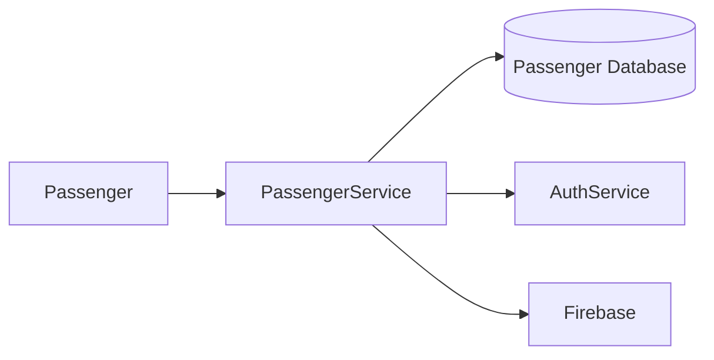

# 🚌 Passenger Service


---

# 📖 Overview

The Passenger Service manages passenger-related operations within the BusTrackPlus platform.

It provides APIs for passenger management, bus pass retrieval, renewal requests, and route information. The service integrates with the Authentication Service for secure access and stores passenger-related data in a dedicated MySQL database.

---

# ✨ Features

- Passenger Management
- Bus Pass Management
- Pass Renewal Requests
- Bus Route Information
- Bus Stop Information
- JWT Authentication
- MySQL Database Integration
- Docker Support

---

# 🏗️ Architecture



---

# 🛠️ Technology Stack

| Technology | Purpose |
|------------|---------|
| Java 21 | Programming Language |
| Spring Boot | Backend Framework |
| Spring Security | Authentication |
| Spring Data JPA | Database Access |
| MySQL | Database |
| Docker | Containerization |
| Firebase | Route & Bus Information |

---

# 📂 Project Structure

```text
src
├── config
├── controller
├── dto
├── model
├── repository
└── service
    └── impl
```

---

# 🗄️ Database

**Database**

```
bus_Plus_Passenger_Service
```

### Tables

| Table |
|-------|
| users |
| passes |
| passestype |
| renew_request |

---

# 📡 API Endpoints

## User

| Method | Endpoint |
|---------|----------|
| GET | /users/by-userid |
| GET | /users/validate |
| GET | /users/by-id/{id} |

## Pass

| Method | Endpoint |
|---------|----------|
| GET | /passes/user |
| GET | /passes/{userId} |

## Renewal Request

| Method | Endpoint |
|---------|----------|
| POST | /renew-requests |

## Connectivity

| Method | Endpoint |
|---------|----------|
| GET | /connectivity/ping |
| GET | /connectivity/firebase |
| GET | /connectivity/bus-numbers |
| GET | /connectivity/bus-numbers/{busNumber}/stops |
| GET | /connectivity/routes/{routeId}/status/{selectedStopIndex} |

---

# 🐳 Docker

The Passenger Service is deployed as part of the **BusTrackPlus Infrastructure** using Docker Compose.

Default Port:

```
8084
```

---

# 🚀 Running the Project

Clone the repository.

```bash
git clone <repository-url>
```

Build the project.

```bash
mvn clean install
```

Run the application.

```bash
mvn spring-boot:run
```

Or run through the BusTrackPlus Infrastructure repository.

```bash
docker compose up --build
```

---

# 🚀 Future Improvements

- Online Pass Payment
- QR Code Based Pass Verification
- Email Notifications
- Push Notifications
- Pass Expiry Reminder
- Digital Ticket Support

---

# 📄 License

This project is intended for educational and portfolio purposes.

Copyright © 2026 Rishi Panneerselvam.